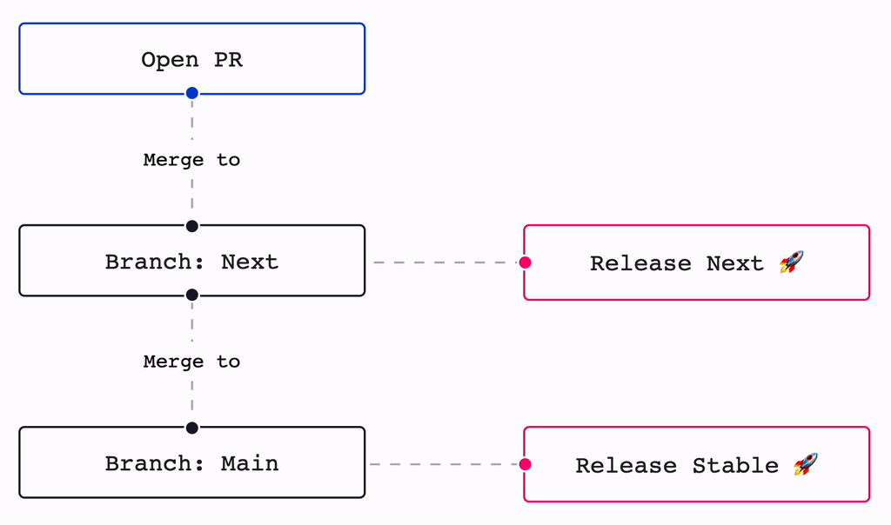

# Contributing to Japanese Moji

We are open to, and grateful for, any contributions made to this repository by you. Please review
the following guide to keep track of our best practices

**Table of Contents**

- [Reporting Issues](#reporting-issues)
- [Local setup](#local-setup)
- [Building](#building)
- [Testing and Linting](#testing-and-linting)
- [New Features](#new-features)
- [Submitting Changes](#submitting-changes)
  - [Making a Pull Request?](#making-a-pull-request)
    - [Commit Convention](#commit-convention)
- [Release flow](#release-flow)

## Reporting Issues

Before opening an issue, please search the
[issue tracker](https://github.com/arjunvegda/japanese-moji/issues) to make sure your issue hasn't
already been reported.

Please ask any general and implementation specific questions via
[GitHub Discussion](https://github.com/arjunvegda/japanese-moji/discussions)

## Local setup

Visit the [Issue tracker](https://github.com/arjunvegda/japanese-moji/issues) to find a list of open
issues that need attention.

Fork, then clone the repo:

```
git clone https://github.com/your-username/japanese-moji.git
```

This repository uses Yarn v3 to manage this package and documentations. You'll need to have Yarn
v1.22 installed globally on your system first, as Yarn v3 depends on that being available first.
Install dependencies with:

```
yarn install

# if you want to work on the documentation locally
cd website && yarn install
```

## Building

Running the `build` task will create CommonJS, ESM, and a UMD build under `/dist`

```
yarn build
```

## Testing and Linting

We use Jest to test our code. Therefore, yarn run test\* supports passing of all the arguments as
Jest

To run the tests:

```
yarn test
```

To continuously watch and run tests, run the following (supports all the arguments as jest):

```
yarn test:watch
```

To run tests with coverage, run the following (supports all the arguments as jest):

```
yarn test:coverage
```

To perform linting with `eslint`, run the following:

```
yarn lint
```

To perform linting with `eslint` and fix it, run the following:

```
yarn lint:fix
```

## New Features

Please open an issue with a proposal for a new feature or refactoring before starting on the work.
We don't want you to waste your efforts on a pull request that we won't want to accept.

## Submitting Changes

- Open a new issue in the [Issue tracker](https://github.com/arjunvegda/japanese-moji/issues)
- Fork the repo
- Create a new feature branch based off the `next` branch
- Make sure all tests pass and that there are no linting errors
- Submit a pull request, referencing any issues it addresses

### Making a Pull Request?

Pull requests require an approval from the maintainers of the project.

#### Commit Convention

We use
[Angular's Conventional commit conventions](https://github.com/angular/angular/blob/master/CONTRIBUTING.md#type).
Please use `category(scope or module): message` format in your commit message and use the following
categories

🚨 **All the changes under `./website/*` are categorized as `docs`, please use `docs` as category
for your commit message in those cases**

- **build**: Changes that affect the build system or external dependencies (example scopes: npm,
  yarn)
- **ci**: Changes to our CI configuration files and scripts (examples: GitHub Actions)
- **docs**: Documentation only changes
- **feat**: A new feature
- **fix**: A bug fix
- **perf**: A code change that improves performance
- **refactor**: A code change that neither fixes a bug nor adds a feature
- **test**: Adding missing tests or correcting existing tests
- **chore**: All changes other changes to the repository that do not fit into any of the above
  categories

Please try to keep your pull request focused in scope and avoid including unrelated commits.

After you have submitted your pull request, we'll try to get back to you as soon as possible. We may
suggest some changes or improvements.

Thank you for contributing 🙌!

## Release flow

We automatically release new versions of `next` branch to next channel on each merge. We also
release new versions of `main` branch on the stable channel on each merge.


