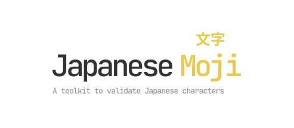

<p align="center">
    <a href="https://japanese-moji.arjunvegda.com">
        
  </a>
</p>
<p align="center">
    <a href="https://www.npmjs.com/package/japanese-moji">
      
    </a>
    <a href="https://bundlephobia.com/package/japanese-moji">
      
    </a>
    <a href="https://bundlephobia.com/package/japanese-moji">
      
    </a>
    <a href="https://bundlephobia.com/package/japanese-moji">
      
    </a>
    <a href="https://codecov.io/gh/arjunvegda/japanese-moji">
      
    </a>
    <a href="https://japanese-moji.arjunvegda.com">
        
    </a>
    <a href="./LICENSE">
      
    </a>
<hr/>

The word "Moji" translates to "Character" in English

**Table of Contents**

- [Features](#-features)
- [Install](#-install)
- [Quick start](#-quick-start)
  - [Kanji](#kanji)
  - [Kana](#kana)
  - [Japanese](#japanese)
- [Types summary](#-types-summary)
- [Build Your Own Validators](#-build-your-own-validators)
- [Recipes](#-recipes)
- [Contributing](#-contributing)
- [Changelog](#-changelog)

## ✨ Features

- Very small footprint with zero dependencies
- Supports strict and threshold-based validation for Kanji, Kana, and all the Japanese characters
  including punctuations
- Exports easy to use score calculator for Kanji, Kana, and the rest of the Japanese characters
- Easy to extend with customizable options and custom validator creators
- Supports both custom single Unicode and Unicode ranges out-of-the-box
- 100% TypeScript friendly
- ESM, CJS, and UMD builds
- Only pay for what you use — it is fully tree-shakable

## 📦 Install

### Yarn

```
yarn add japanese-moji
```

### NPM

```
npm install --save japanese-moji
```

## 👨‍💻 Quick start

### Kanji

Validates Rare Kanji, Common and Uncommon Kanji, and Kanji compatibility ideographs <br/><br/>
<a href="https://japanese-moji.arjunvegda.com/demos#kanji">
 </a>

```ts
import { isValidKanji, isKanjiPresent, howMuchKanjiIsPresent } from 'japanese-moji';

// Strict validation
const isValidKanjiResult = isValidKanji('some string here');

// Default threshold is 85 (2nd argument)
const isKanjiPresentResult = isKanjiPresent('some string here', 90);

// Returns % of Kanji present in a string
const howMuchKanjiIsPresentResult = howMuchKanjiIsPresent('some string here');
```

### Kana

Validates Katakana, Half-width Katakana, and Katakana phonetic extensions <br/><br/>
<a href="https://japanese-moji.arjunvegda.com/demos#kana">
 </a>

```ts
import { isValidKana, isKanaPresent, howMuchKanaIsPresent } from 'japanese-moji';

// Strict validation
const isValidKanaResult = isValidKana('some string here');

// Default threshold is 85 (2nd argument)
const isKanaPresentResult = isKanaPresent('some string here', 90);

// Returns % of Kana present in a string
const howMuchKanaIsPresentResult = howMuchKanaIsPresent('some string here');
```

### Japanese

Validates CJK punctuations, Hiragana, Katakana, Katakana phonetic extensions, Rare Kanji, Common and
Uncommon Kanji, Kanji compatibility ideographs, Half-width Katakana forms, and Full-width (roman)
forms including punctuations <br/><br/>
<a href="https://japanese-moji.arjunvegda.com/demos#japanese">
 </a>

```ts
import { isValidJapanese, isJapanesePresent, howMuchJapaneseIsPresent } from 'japanese-moji';

// Strict validation
const isValidJapaneseResult = isValidJapanese('some string here');

// Default threshold is 85 (2nd argument)
const isJapanesePresentResult = isJapanesePresent('some string here', 90);

// Returns % of Japanese present in a string
const howMuchJapaneseIsPresentResult = howMuchJapaneseIsPresent('some string here');
```

## 📝 Types summary

```ts
enum CharacterSet {
  CJKPunctuations = 'CJKPunctuations',
  Hiragana = 'Hiragana',
  Katakana = 'Katakana',
  KatakanaPhoneticExtension = 'KatakanaPhoneticExtension',
  RareKanji = 'RareKanji',
  KanjiCompatibilityIdeographs = 'KanjiCompatibilityIdeographs',
  CommonUncommonKanji = 'CommonUncommonKanji',
  HalfWidthKatakana = 'HalfWidthKatakana',
  FullWidthUpperCase = 'FullWidthUpperCase',
  FullWidthLowerCase = 'FullWidthLowerCase',
  FullWidthNumbers = 'FullWidthNumbers',
  FullWidthPunctuations = 'FullWidthPunctuations',
}

interface UnicodeRange {
  start: string;
  end: string;
}

interface CreateValidatorOptions {
  characterSets: CharacterSet[];
  customRanges?: UnicodeRange[];
  customUnicodes?: string[];
}

type StrictValidator = (arg: string) => boolean;
type ThresholdBasedValidator = (arg: string, threshold?: number) => boolean;
type MatchScoreCalculator = (arg: string) => number;
```

## 🛠 Build Your Own Validators

You could create custom validators too, should the existing validators not fit your use case.

There are also ready-to-use, copy-pastable code snippets that may fit your use cases
[here](./docs/RECIPES.md)

```ts
import {
  // Types
  UnicodeRange,
  CreateValidatorOptions,
  StrictValidator,
  ThresholdBasedValidator,
  MatchScoreCalculator,
  CharacterSet,

  // Functions
  createStrictValidator,
  createThresholdBasedValidator,
  createMatchScoreCalculator,
} from 'japanese-moji';

// Requires escaped unicode characters
const LatinUnicodeRange: UnicodeRange = {
  start: '\\u0020',
  end: '\\u007F',
};

const customRanges: UnicodeRange[] = [LatinUnicodeRange];

// Provide escaped unicode characters
const customUnicodes = ['\\u00A0'];

const options: CreateValidatorOptions = {
  // Required
  characterSets: [
    CharacterSet.CJKPunctuations,
    CharacterSet.Hiragana,
    CharacterSet.Katakana,
    CharacterSet.KatakanaPhoneticExtension,
    CharacterSet.RareKanji,
    CharacterSet.CommonUncommonKanji,
    CharacterSet.KanjiCompatibilityIdeographs,
    CharacterSet.HalfWidthKatakana,
    CharacterSet.FullWidthUpperCase,
    CharacterSet.FullWidthLowerCase,
    CharacterSet.FullWidthNumbers,
    CharacterSet.FullWidthPunctuations,
  ],
  customRanges, // Optional
  customUnicodes, // Optional
};

const isValidCustom: StrictValidator = createStrictValidator(options);
const isCustomPresent: ThresholdBasedValidator = createThresholdBasedValidator(options);
const howMuchIsCustomPresent: MatchScoreCalculator = createMatchScoreCalculator(options);

// Strict validation
const isValidCustomResult = isValidCustom('some string here');

// Default threshold is 85 (2nd argument)
const isCustomPresentResult = isCustomPresent('some string here', 90);

// Returns % of Japanese present in a string
const howMuchIsCustomPresentResult = howMuchIsCustomPresent('some string here');
```

## 📚 Recipes

Find code snippets containing variety of combinations that makes creating custom validators easy in
[docs/RECIPES.md](./docs/RECIPES.md) <br/><br/>
<a href="https://japanese-moji.arjunvegda.com/demos#custom-recipes">
 </a>

## 🙌 Contributing

Find contribution guides, code convention, release flows etc. in
[CONTRIBUTING.md](./CONTRIBUTING.md)

## 📄 Changelog

Full change log available in the [docs/CHANGELOG.md](./docs/CHANGELOG.md)
